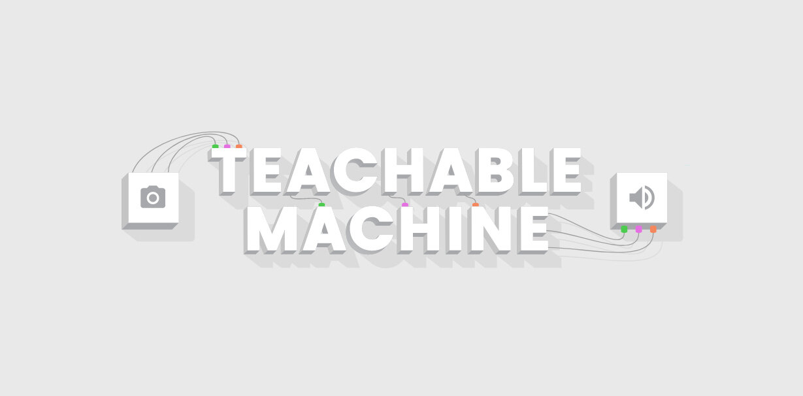

#### Basic Emotion Detection App 
##### Affective Computing Research

This product was built based on research I supervised during the Spring 2022 semester.

A total of 200 facial images (with diverse representation) were collated and classified into 5 emotional classes, namely:
- Happy
- Sad
- Scared
- Angry
- Neutral

Training was performed on Google Teachable Machine, a low-code machine solution.

**Graduate Students (Masters of Applied Informatics - IT Innovations in Business)**:

- Liu Xiaozhi
- Sun Xu
- Avinash Kumar
- Al-Samarrai Safa Shakir Awad

**Project Workshop Topic: 77/ЛКП-618-2022. Creation of Emotion Detection Models using Deep Learning**

**Ural Federal University - Department of Big Data Analysis and Methods of Videoanalysis**

**Supervisor**:
- Ebenezer Agbozo (eagbozo@urfu.ru | agbozo1@gmail.com)

#### Built with

